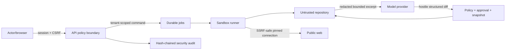

# AI Auditor threat model

## Overview

AI Auditor reads an untrusted JavaScript/TypeScript repository, runs bundled analysis, may crawl public URLs, sends redacted source excerpts to a configured model, and can apply approved diffs. Local mode binds its UI to loopback; team-mode primitives require signed sessions, live tenant membership, CSRF validation and object ownership.

| Component | Sensitive operation | Evidence |
|---|---|---|
| Patch pipeline | canonical path validation, snapshot/hash check, apply/rollback | `src/fix/diffApplier.ts:24`, `src/fix/patchTransaction.ts:40`, `src/server/index.ts:509` |
| Model context | excludes absolute/protected/secret paths and redacts values | `src/fix/contextBuilder.ts:16`, `src/core/trustSecurity.ts:26` |
| Crawler | DNS validation, pinned lookup, redirect revalidation, byte/time limits | `src/platform/security/networkPolicy.ts:18`, `src/platform/security/networkPolicy.ts:28`, `src/platform/security/networkPolicy.ts:42` |
| Analyzer process | no shell, allowlisted environment, bounded memory/time/output | `src/analyzers/tsc.ts:12`, `src/platform/security/sandboxRunner.ts:11` |
| Team authorization | HMAC session, tenant membership, CSRF and object ownership | `src/platform/security/teamAuth.ts:5` |
| Security audit | redacted append-only hash chain | `src/platform/security/audit.ts:7` |

## Threat model, trust boundaries, and assumptions

Protected assets are repository integrity, credentials, tenant data, audit integrity, model inputs and artifact confidentiality. A malicious repository controls filenames, symlinks, configuration and source text but not operator approval, host credentials or release signing. Public pages control redirects and content but may not gain access to private/metadata networks. Model output is untrusted and gains write authority only through path policy, actor-bound approval, snapshot hash verification and post-apply verification.

Local execution is process isolation with explicit environment/resource bounds, not a kernel security boundary. Team deployment must place `LocalSandboxRunner` behind an ephemeral container/OS sandbox with network disabled except through the broker. Authenticated/private crawl profiles are disabled unless deployment policy explicitly enables them. The signing/release workflow depends on GitHub OIDC and protected tags.

## Attack surface, mitigations, and attacker stories

| Priority | Scenario and capability gain | Prerequisites | Impact | Existing controls / mitigation | Evidence |
|---|---|---|---|---|---|
| Critical hypothesis | crafted diff escapes the repo | model controls diff | host file write | lexical + realpath containment, ADS/absolute/protected rejection, negative tests | `src/fix/diffApplier.ts:24` |
| High hypothesis | symlink/junction swapped between preview and apply | repository can mutate concurrently | unintended file mutation | ancestor realpath validation and source hash recheck; containerize team workers | `src/fix/patchTransaction.ts:40` |
| High hypothesis | redirect/DNS rebinding reaches metadata/private services | attacker controls DNS/redirect | credential or internal-data theft | validate all answers/redirects and pin socket lookup | `src/platform/security/networkPolicy.ts:18` |
| High hypothesis | source/page prompt injection causes unsafe patch | malicious content reaches model | fix mode and approval | structured schema, patch budgets, hostile-diff policy, revalidation before apply | `src/core/engine.ts:324`, `src/server/index.ts:509` |
| High hypothesis | cross-tenant IDOR | team API exposed | guessed foreign ID | membership plus tenant-bound ownership check; mandatory integration by team adapter | `src/platform/security/teamAuth.ts:5` |
| Medium hypothesis | secret leaks via trace/report/process output | seeded credential present | confidentiality loss | known/entropy redaction at context, audit and sandbox output boundaries | `src/core/trustSecurity.ts:26`, `src/platform/security/sandboxRunner.ts:14` |
| Medium hypothesis | dependency install/lifecycle compromise | compromised package/version | CI or developer execution | `npm ci --ignore-scripts`, locked graph, audit/license gate, SBOM and provenance attestation | `.github/workflows/release-security.yml:14` |

## Severity calibration

- Critical: proven host escape or cross-tenant credential compromise without further privileged action.
- High: reachable private-network access, unauthorized protected-file mutation, or tenant IDOR with material data exposure.
- Medium: secret exposure requiring local/operator access, bounded denial of service, or control weakness with a deployment prerequisite.
- Low: tamper-evident audit availability issue or self-only local effect with no new authority.

These are scenarios, not validated vulnerability findings. Kernel-level isolation and a live team identity provider are deployment prerequisites; absence in local mode is not claimed as remote exposure.

Repository: AI-Agent-Code-Optimization
Version: working-tree-2026-09-03
